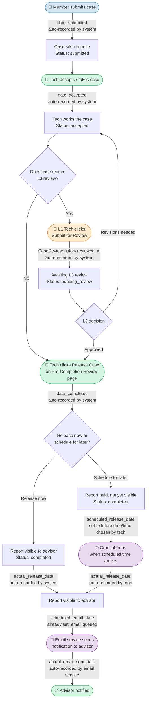

# Case Date Fields — Reference Guide

**Purpose:** Clarify the terminology and timing of every date recorded on a case, from member submission through advisor notification.

---

## The Complete Case Timeline



---

## Date Field Quick Reference

| Field Name (in system) | Plain-language label | Who/what sets it | When it is set |
|---|---|---|---|
| `date_submitted` | **Submitted** | System (automatic) | The instant the member clicks Submit |
| `date_accepted` | **Accepted** | System (automatic) | The instant a tech accepts / takes the case |
| `date_due` | **Due Date** | Tech / Admin (manual) | Assigned manually when the tech sets the deadline |
| `date_scheduled` | **Scheduled Date** | Tech / Admin (manual) | Optional target date set by the tech for planning |
| `CaseReviewHistory.reviewed_at` | **Submitted for Review** | System (automatic) | The instant the L1 tech clicks "Submit for Review" — creates an audit record |
| `date_completed` | **Tech Finished** | System (automatic) | The instant the tech clicks "Release Case" on the Pre-Completion Review page — **this is when the tech's work is done, NOT when the advisor sees it** |
| `scheduled_release_date` | **Release Scheduled For** | System (set by tech's choice) | Set at the same moment as `date_completed`, only if the tech chose a future release time |
| `actual_release_date` | **Released to Advisor** | System (automatic) | For immediate release: same moment as `date_completed`. For scheduled release: set by the cron job when the scheduled time arrives |
| `scheduled_email_date` | **Email Scheduled For** | System (set with release) | Set at the same moment as `scheduled_release_date` — the system uses this to know when to send the email |
| `actual_email_sent_date` | **Email Sent to Advisor** | System / Email service (automatic) | The instant the notification email is successfully delivered — set by the email service after confirming the send |

---

## The Critical Distinction: Completed vs. Released

This is the most common source of confusion.

```
date_completed          = When the TECH finished the work
actual_release_date     = When the ADVISOR can see the report
actual_email_sent_date  = When the ADVISOR received the email notification
```

These three can all be different dates:

| Scenario | date_completed | actual_release_date | actual_email_sent_date |
|---|---|---|---|
| Tech releases immediately | Mon 9:00 AM | Mon 9:00 AM | Mon 9:00 AM |
| Tech schedules release for next day | Mon 9:00 AM | Tue 8:00 AM | Tue 8:00 AM |
| Tech schedules release for specific date | Mon 9:00 AM | Thu 10:00 AM | Thu 10:00 AM |

The **cron job** is the automated system process that checks at regular intervals whether any scheduled releases are due. When it finds one, it:
1. Sets `actual_release_date` (marks the case as released)
2. Triggers the email service
3. Email service sets `actual_email_sent_date` after confirming delivery

---

## The L3 Review Path

When an L1 tech submits a case for review, a **separate audit record** is created (`CaseReviewHistory`). This record has its own timestamp field called `reviewed_at`. It is **not** on the main case record.

```
One case can have MULTIPLE CaseReviewHistory records:
  Record 1: reviewed_at = Mon 2:00 PM   action = submitted_for_review
  Record 2: reviewed_at = Mon 4:30 PM   action = revisions_requested
  Record 3: reviewed_at = Tue 9:00 AM   action = resubmitted
  Record 4: reviewed_at = Tue 11:00 AM  action = approved
```

When the Performance Dashboard / Scorecard shows **"Submitted for Review,"** it counts the number of `CaseReviewHistory` records with `action = submitted_for_review` — not unique cases. One case that is submitted, revised, and resubmitted counts as **two** submission events.

---

## Which Date Does Each Metric Use?

| Metric | Date field used | What it measures |
|---|---|---|
| Reports Generated (dashboard tile) | `date_completed` | When the tech finished — filtered by tech's completion date |
| Submitted for Review (dashboard tile) | `CaseReviewHistory.reviewed_at` | When the L1 clicked Submit for Review |
| On-Time Delivery % | `date_completed` vs `date_due` | Was the tech done before the due date? |
| ProFeds Errors | `date_submitted` (of the mod case) | When the member reported the error |
| Production Cycle Time | `date_submitted` → `date_completed` | Days from member submission to tech finishing |
| Readiness Window | `date_completed` vs `date_due` | How many days early/late the tech finished |
| Report Accuracy % | `date_completed` | Completed cases with no error flag |
| Initial Submissions | `date_submitted` | When the advisor originally submitted the case |

**Note:** No performance metric currently uses `actual_release_date` or `actual_email_sent_date`. Those fields track the advisor experience (when they got the report), not the technician's work.
